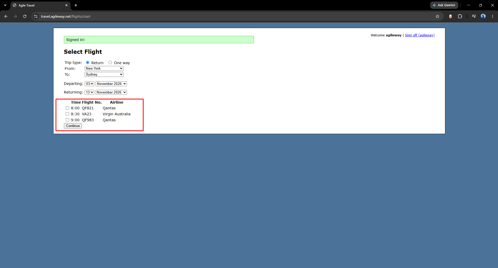

# Book Flight — Bug Reports

## BG-1: Flight Selection > User can proceed to Passenger Details page without selecting a flight

**Steps to reproduce:**

1. Navigate to the Select Flight page.
2. Fill in valid flight search criteria (trip type, origin, destination, and dates).
3. Without checking any flight checkbox in the flight list click "Continue".

**Expected result:**
The system should display a validation error message indicating that a flight must be selected, and should not proceed past the Select Flight page.

**Actual result:**
The system proceeds directly to the Passenger Details page without requiring a flight selection, with no validation error shown.

**Screenshot of the bug [BF-1]:**

---

## BG-2: Flight Selection > User can select multiple flight checkboxes simultaneously

**Steps to reproduce:**

1. Navigate to the Select Flight page.
2. Fill in valid flight search criteria (trip type, origin, destination, and dates).
3. Check more than one flight checkbox in the flight list.

**Expected result:**
The system should only allow one flight checkbox to be selected at a time.

**Actual result:**
The system allows all flight checkboxes to be selected simultaneously, with no restriction preventing multiple selections.

**Screenshot of the bug [BG-2]:**

---

## BG-3: Flight Selection > User can proceed without selecting a Destination

**Steps to reproduce:**

1. Navigate to the Select Flight page.
2. Select Trip type and Origin, and fill in valid dates.
3. Leave the "To" (Destination) field set to the default placeholder value ("Destination") without selecting an actual city.
4. Select one of the flight checkboxes from the list.
5. Click "Continue".

**Expected result:**
The system should not display flight results or allow the user to proceed when no Destination is selected; it should show a validation error requiring a Destination to be chosen.

**Actual result:**
The user is redirected to the Passenger Details page even though the Destination field was left at the default placeholder ("Destination") with no city selected.

**Screenshot of the bug [BG-3]:**

---

## BG-4: Flight Selection > User can proceed without selecting an Origin

**Steps to reproduce:**

1. Navigate to the Select Flight page.
2. Select Trip type and Destination, and fill in valid dates.
3. Leave the "From" (Origin) field set to the default placeholder value ("Origin") without selecting an actual city.
4. Select one of the flight checkboxes from the list.
5. Click "Continue".

**Expected result:**
The system should not display flight results or allow the user to proceed when no Origin is selected; it should show a validation error requiring an Origin to be chosen.

**Actual result:**
The user is redirected to the Passenger Details page even though the Origin field was left at the default placeholder ("Origin") with no city selected.

**Screenshot of the bug [BG-4]:**

---

## BG-5: Flight Selection > User can proceed when Origin and Destination are the same city

**Steps to reproduce:**

1. Navigate to the Select Flight page.
2. Select the same city for both "From" (Origin) and "To" (Destination)
3. Fill in valid Departing and Returning dates.
4. Select one of the flight checkboxes from the list.
5. Click "Continue".

**Expected result:**
The system should not display flight results or allow the user to proceed when Origin and Destination are the same city; it should show a validation error requiring different cities.

**Actual result:**
The system displays flight results and allows the user to select a flight and proceed, even though Origin and Destination are both set to "New York".

**Screenshot of the bug [BG-5]:**

---

## BG-6: Flight Selection > User can proceed when the Departing date is in the past

**Steps to reproduce:**

1. Navigate to the Select Flight page.
2. Select valid Trip type, Origin, and Destination.
3. Set the Departing date to a date earlier than the current date.
4. Select one of the flight checkboxes from the list.
5. Click "Continue".

**Expected result:**
The system should not display flight results or allow the user to proceed when the Departing date is in the past; it should show a validation error requiring a valid future (or current) Departing date.

**Actual result:**
The system displays flight results and allows the user to select a flight and proceed, even though the Departing date is earlier than the current date.

**Screenshot of the bug [BG-6]:**

---

## BG-7: Flight Selection > User can proceed when the Returning date is earlier than the Departing date

**Steps to reproduce:**

1. Navigate to the Select Flight page
2. Select valid Trip type, Origin, and Destination.
3. Set the Departing date to 06 November 2026 and the Returning date to 03 November 2026 (Returning date earlier than Departing date).
4. Select one of the flight checkboxes from the list.
5. Click "Continue".

**Expected result:**
The system should not display flight results or allow the user to proceed when the Returning date is earlier than the Departing date; it should show a validation error requiring the Returning date to be on or after the Departing date.

**Actual result:**
The system displays flight results and allows the user to select a flight and proceed, even though the Returning date (03 November 2026) is earlier than the Departing date (06 November 2026).

**Screenshot of the bug [BG-7]:**

---

## BG-8: Passenger Details > User can proceed when First name is left empty

**Steps to reproduce:**

1. Navigate to the Passenger Details page after selecting a valid flight.
2. Leave the "First name" field empty.
3. Enter a value in the "Last name" field.
4. Click "Next".

**Expected result:**
The system should not allow the user to proceed when the First name field is empty; it should show a validation error requiring the First name to be filled in.

**Actual result:**
The user is redirected to the Payment page even though the First name field was left empty.

**Screenshot of the bug [BG-8]:**

---

## BG-9: Passenger Details > User can proceed when First name or Last name contains invalid special characters

**Steps to reproduce:**

1. Navigate to the Passenger Details page after selecting a valid flight.
2. Enter invalid special characters into the "First name" field (e.g., "#! %#").
3. Enter invalid special characters into the "Last name" field (e.g., "# #%#").
4. Click "Next".

**Expected result:**
The system should not allow the user to proceed when First name or Last name contains invalid special characters; it should show a validation error requiring valid alphabetic input.

**Actual result:**
The user is redirected to the Payment page even though both First name and Last name contain invalid special characters.

**Screenshot of the bug [BG-9]:**

---

## BG-10: Passenger Details > User can proceed when First name or Last name contains numeric characters

**Steps to reproduce:**

1. Navigate to the Passenger Details page after selecting a valid flight.
2. Enter numeric characters into the "First name" field (e.g., "123456").
3. Enter numeric characters into the "Last name" field (e.g., "1234567").
4. Click "Next".

**Expected result:**
The system should not allow the user to proceed when First name or Last name contains numeric characters; it should show a validation error requiring valid alphabetic input.

**Actual result:**
The user is redirected to the Payment page even though both First name and Last name contain only numeric characters.

**Screenshot of the bug [BG-10]:**

---

## BG-11: Passenger Details > User can proceed when First name or Last name contains only whitespace

**Steps to reproduce:**

1. Navigate to the Passenger Details page after selecting a valid flight.
2. Enter only whitespace (spaces) into the "First name" field.
3. Enter only whitespace (spaces) into the "Last name" field.
4. Click "Next".

**Expected result:**
The system should not allow the user to proceed when First name or Last name contains only whitespace; it should show a validation error requiring valid input.

**Actual result:**
The user is redirected to the Payment page even though both First name and Last name contain only whitespace.

**Screenshot of the bug [BG-11]:**

---

## BG-12: Payment > User can proceed when Card holder's name contains numeric characters

**Steps to reproduce:**

1. Navigate to the Payment page after completing valid Passenger Details.
2. Select a Card type (e.g., Visa).
3. Enter numeric characters into the "Card holder's name" field (e.g., "111111").
4. Enter a valid Card number and Expiry date.
5. Click "Pay now".

**Expected result:**
The system should not allow the user to proceed when Card holder's name contains numeric or invalid special characters; it should show a validation error requiring valid alphabetic input.

**Actual result:**
The system processes the payment and generates a booking confirmation (Booking number: 116191) even though the Card holder's name field contains only numeric characters ("111111").

**Screenshot of the bug [BG-12]:**

---

## BG-13: Payment > User can proceed when Card holder's name is empty

**Steps to reproduce:**

1. Navigate to the Payment page after completing valid Passenger Details.
2. Select a Card type (e.g., Visa).
3. Leave the "Card holder's name" field empty.
4. Enter a valid Card number and Expiry date.
5. Click "Pay now".

**Expected result:**
The system should not allow the user to proceed when the Card holder's name field is empty; it should show a validation error requiring the field to be filled in.

**Actual result:**
The system processes the payment and generates a booking confirmation (Booking number: 116191) even though the Card holder's name field was left empty.

**Screenshot of the bug [BG-13]:**

---

## BG-14: Payment > User can proceed when Card number contains non-numeric characters

**Steps to reproduce:**

1. Navigate to the Payment page after completing valid Passenger Details.
2. Select a Card type (e.g., Visa) and enter a valid Card holder's name.
3. Enter non-numeric characters into the "Card number" field (e.g., "aaaa aaaa aaaa aaaa").
4. Enter a valid Expiry date.
5. Click "Pay now".

**Expected result:**
The system should not allow the user to proceed when the Card number field contains non-numeric characters; it should show a validation error requiring a valid numeric card number.

**Actual result:**
The system processes the payment and generates a booking confirmation (Booking number: 116191) even though the Card number field contains only letters ("aaaa aaaa aaaa aaaa").

**Screenshot of the bug [BG-14]:**

---

## BG-15: Payment > User can proceed when Card number is empty

**Steps to reproduce:**

1. Navigate to the Payment page after completing valid Passenger Details.
2. Select a Card type (e.g., Visa) and enter a valid Card holder's name.
3. Leave the "Card number" field empty.
4. Enter a valid Expiry date.
5. Click "Pay now".

**Expected result:**
The system should not allow the user to proceed when the Card number field is empty; it should show a validation error requiring the field to be filled in.

**Actual result:**
The system processes the payment and generates a booking confirmation (Booking number: 116191) even though the Card number field was left empty.

**Screenshot of the bug [BG-15]:**

---

## BG-16: Payment > User can proceed when no Card type is selected

**Steps to reproduce:**

1. Navigate to the Payment page after completing valid Passenger Details.
2. Leave both "Visa" and "Master" Card type radio buttons unselected.
3. Enter a valid Card holder's name, Card number, and Expiry date.
4. Click "Pay now".

**Expected result:**
The system should not allow the user to proceed when no Card type is selected; it should show a validation error requiring a Card type to be chosen.

**Actual result:**
The system processes the payment and generates a booking confirmation (Booking number: 116191) even though no Card type (Visa or Master) was selected.

**Screenshot of the bug [BG-16]:**

---

## BG-17: Payment > User can proceed when the Expiry date is earlier than the current month and year

**Steps to reproduce:**

1. Navigate to the Payment page after completing valid Passenger Details.
2. Select a Card type, and enter a valid Card holder's name and Card number.
3. Set the Expiry date to a month/year earlier than the current date
4. Click "Pay now".

**Expected result:**
The system should not allow the user to proceed when the Expiry date is earlier than the current month and year; it should show a validation error requiring a valid, non-expired card.

**Actual result:**
The system processes the payment and generates a booking confirmation (Booking number: 116191) even though the Expiry date (01/2026) is earlier than the current date.

**Screenshot of the bug [BG-17]:**

---

## BG-18: Payment > Clicking "Pay now" multiple times in quick succession sends multiple duplicate confirm requests

**Steps to reproduce:**

1. Navigate to the Payment page after completing valid Passenger Details.
2. Fill in valid Card type, Card holder's name, Card number, and Expiry date.
3. Click the "Pay now" button multiple times in quick succession.
4. Open DevTools > Network tab and observe the requests sent.

**Expected result:**
The system should disable the "Pay now" button (or otherwise prevent resubmission) after the first click, sending only one confirm request and generating only one Booking number for the transaction.

**Actual result:**
Multiple duplicate "confirm" XHR requests (19 requests observed, all returning status 200) are sent to the server, one for each click, with no debounce or button-disable protection preventing resubmission — creating risk of duplicate bookings or charges for a single transaction.

**Screenshot of the bug [BG-18]:**

---
